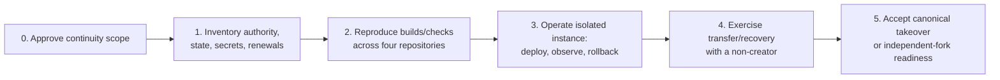

# Successor Time-To-Safety Map

## Evidence Boundary

This map identifies gates and skills, not elapsed time or staffing cost. No non-creator exercise, time log, maintainer availability, labor rate, budget, or live access evidence was approved. Completion time is therefore `unknown` until OI-004 records it.

## Skill And Burden Map

| Area | Required successor skill | Evidence-backed burden | Burden reducer | Safety gate |
|---|---|---|---|---|
| Product code/build | Modern Node.js/JavaScript, filesystem/process tooling, generated artifacts, Worker request code | Broad functionality; critical Worker/build/setup/upgrade orchestrators are large; complexity warnings are non-blocking | 14-part declared suite, integrated check, ADRs, source/instance ownership model | Clean build/check plus focused change and rollback; OI-004/OI-009 |
| Link/product semantics | Exact/splat routing, lifecycle, schedules/timezones, policy/blocklists, localization | Many durable behaviors can regress independently | PDRs, reference docs, focused tests, source-controlled registry | Demonstrate representative links/states/schedules/policy; OI-004 |
| Cloudflare runtime/security | Workers/Wrangler, Assets, Access/JWT, WAF/rate limits, logs | Provider UI/configuration and account-bound settings extend beyond Git | Terraform intent, security model, fail-closed source tests | Prove applied state, roles, alerts, deploy/rollback; OI-002/OI-006/OI-012 |
| Infrastructure/domain | Terraform, state/import/drift, DNS/TLS, registrar/renewal | State/backend/owners/renewal/recovery are unknown; public change history is minimal | Small Terraform repository and explicit resource declarations | State/import/drift/recovery and domain-transfer evidence; OI-002/OI-006/OI-007 |
| Release/supply chain | GitHub rules, PR review, Actions, semantic releases, Sigstore/gitsign | Human signer/admin dependency; upgrade does not enforce signature verification | Detailed release workflow, releases, two declared signers | Successor-signed release and verified upgrade; OI-002/OI-010 |
| Website/documentation | Hugo, Go, Sass, Node/Pagefind, Markdown/YAML/link/spell checks, multilingual content | 97 catalogued docs; no npm lockfile or hosted quality gate; one declared maintainer | Broad task-oriented docs and source of truth | Reproducible docs build/check and cross-repo ownership; OI-005/OI-008 |
| Security/privacy/trust | CSP/CORS/headers, secret handling, analytics data, public contacts, incident intake | Live identity/custody/retention/sign-off unknown | Strong source model, optional analytics, no runtime npm dependencies | Redacted custody/offboarding and specialist acceptance where claimed; OI-002/OI-003/OI-010 |
| Operations/recovery | Monitoring, alerts, incident triage, deployment, rollback, restore, communication | No alert delivery, on-call, RTO/RPO, state restore, or recovery drill | Stateless runtime, Git-backed link data, rollback checklist | Test alert, incident, restore/rollback, and successor response; OI-004/OI-006/OI-012 |

## Gate Sequence

Do not skip Gate 1 by writing procedures that no successor has authority to execute. Do not interpret Gate 3 as proof of canonical takeover; Gate 4 must exercise the actual transfer boundary.

## Bounded Burden Conclusion

The replacement burden is moderate for independent source evolution and materially higher for the existing service’s governance/control plane. The likely effort driver is cross-skill authority and operations—not the core redirect algorithm. Exact time and staffing remain unknown pending OI-004.
