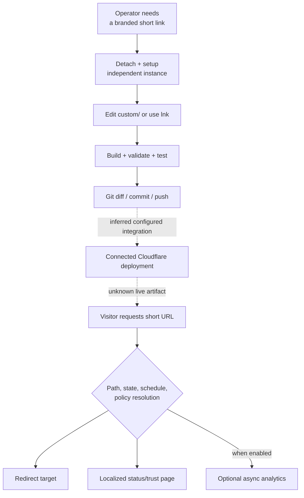

# Operator-To-Redirect Product Flow

## Purpose And Evidence Boundary

- Reader question: Which steps turn an operator’s intent into a public redirect, and where does demonstrated product evidence stop?
- Evidence cutoff: July 22, 2026.
- Confirmed notation: Solid arrows are implemented or documented in cutoff-pinned source.
- Inferred notation: Dashed `inferred` arrows are conditional external integrations.
- Unknown notation: Dotted `unknown` arrows require independent execution, live state, or acceptance evidence.
- Evidence links: [PDR register](../pdr-register.md), [configuration contract](../config-contract-matrix.md), [delivery packet](../../../evidence/packets/delivery-and-quality.md).

## Evidence Dimensions Used

Product promise, implementation, source history, and documentation are present. Independent demonstration, user acceptance, live control state, specialist sign-off, and commercial evidence are unknown.

## Diagram

## Known Gaps And Follow-Up

The source path is coherent, but no approved non-creator completed it and no cutoff-bounded live response was observed. OI-004 is the minimum proof for low-touch onboarding; OI-002/OI-006 are additionally required to inherit the existing project/domain.
