# Release And Change-Control Position

## Evidence Boundary

This view uses public source, Git/GitHub records, and unauthenticated metadata through July 22, 2026. No authenticated branch/ruleset settings, private review, deployment, local check, or runtime result was available.

## Evidence Dimensions Used

Implementation declarations, Git history, public PR/issues/releases, and sampled hosted Actions are present. Actual enforcement, administrative ownership, deployment acceptance, runtime health, staffing availability, and cost are unknown.

## Repository Position

| Repository | Public work/release record through cutoff | Declared checks/change controls | Material gap |
|---|---|---|---|
| `code` | 75 PRs, 9 standalone issues, 38 releases; 3 open dependency PRs; 402 main commits | Broad `npm run check`; hosted check/dependency review/release preparation; desired review/signing rules; manual signed-tag release | Actual branch/tag enforcement and deployment unknown; selected review evidence is sparse; release depends on trusted signer/admin access |
| `website` | 42 PRs, no standalone issues, 38 releases; 1 open release PR; 452 main commits | Package commands declare build/test/lint/link checks; hosted workflows only prepare releases and remind on `security.txt` expiry | No hosted quality gate; no npm lockfile; package/release manifest versions differ; one declared maintainer |
| `v8s-config` | 3 commits; no public PR, issue, Actions, or release history | README declares manual Terraform init/fmt/validate/plan; provider lock exists | No public review/CI/apply/change record, governance, state proof, or rollback exercise |
| `v8s-link` | 1 commit; no public PR, issue, Actions, or release history | Product package declares checks; only an inactive upgrade-nudge template | No public review/CI/release/deployment/operation history or governance |

## Declared Product Release Path

```mermaid
flowchart LR
  CHANGE["Contributor change"] --> PR["Pull request"]
  PR --> CHECK["Hosted check / dependency review"]
  CHECK --> REVIEW["Human review"]
  REVIEW --> MERGE["Merge to main"]
  MERGE --> PREP["Release Please prepares release PR"]
  PREP --> RCHECK["Maintainer local/CI checks"]
  RCHECK --> SIGN["Trusted maintainer signs tag"]
  SIGN --> RELEASE["GitHub release"]
  RELEASE -. "unknown external connection" .-> DEPLOY["Cloudflare deployment"]
  DEPLOY -. "unknown evidence" .-> ACCEPT["Smoke/rollback acceptance"]
```

The flow is well documented for `code`, but no equivalent end-to-end public change-control record exists for `v8s-config` or `v8s-link`.

## Material Unknowns And Closure Routes

- OI-002: prove owners, administrative rules, signer recovery, and successor release authority.
- OI-007: establish review and automated validation for infrastructure and instance repositories.
- OI-008: make website dependency resolution and quality gating reproducible.
- OI-004: exercise the complete non-creator change/release/deploy/rollback path.
