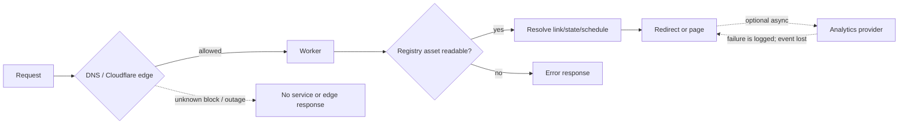

# Capacity And Degradation Envelope

## Evidence Boundary

This view uses cutoff-pinned source/configuration and public operations documentation through July 22, 2026. No traffic, latency, error, CPU, memory, asset-size, quota, plan, load-test, cost, log, or live deployment evidence was approved. Unknown limits are not treated as bottlenecks.

## Source-Bounded Envelope

| Dimension | Source-visible behavior | Degradation/failure behavior | Known limit | Material unknown |
|---|---|---|---|---|
| Public request execution | Stateless Worker request path; exact/splat tree traversal by slug segments; generated registry loaded from bound assets | Registry asset read failure returns an error response; no repository-defined runtime replica/fallback | None declared | Cloudflare Worker/assets limits, latency, cache behavior, request volume, registry size |
| Link data growth | Build parses all source links, emits one JSON tree, validates and flattens it for some reports/stats | Build/check time and registry payload grow with link/schedule/policy content | Lookup input capped to 99 characters; no link-count/registry-size budget | Practical maximum links, schedules, languages, build duration/memory, deploy size |
| Scanner policy | Blocklist is cached per isolate after an asset read | Read/parse failure yields an empty runtime scanner fallback so ordinary redirect service continues | None declared | Frequency/impact of failure and whether edge WAF is applied |
| Access/JWKS | JWKS cached per isolate for one hour, refresh throttled for one minute; stale cache may serve during fetch error | With no usable keyset/configuration, private operational paths fail closed; public redirects remain separate | Source TTLs only | Access availability, identity-provider quota, rotation behavior under real traffic |
| Analytics providers | Optional, asynchronous via `waitUntil`; provider calls catch/log failures | Redirect/page response should continue; events may be lost and no retry/queue is declared | Provider/account-specific and undocumented in approved evidence | Event volume, provider quota, retention, delivery/error rate, cost |
| Edge abuse controls | Terraform declares 20 candidate requests per 10 seconds per IP with a 10-second block; WAF/Access intended before Worker | Legitimate high-volume/shared-IP clients could be blocked; absent/drifted rule could expose Worker/provider quotas | One source-declared demo rule | Applied plan/rule, bypasses, false positives, traffic distribution |
| Target validation | Target checker defaults to concurrency 8 and 8-second request timeout; total runtime unlimited unless configured | External endpoints can slow/fail checks; max-runtime option can leave targets unchecked | Source defaults only | Real link count, CI timeout, expected maintenance window |
| Operations/response | Invocation logging declared; no repository queue, database, autoscaling, replica, failover, or SLO config | Cloudflare/domain/deployment outage affects the public service; alert/response path unproved | Provider-managed/unknown | Availability target, alert delivery, recovery time, quotas, regional behavior |

## Degradation Sequence

## Closure Route

OI-011 should define realistic small/medium envelopes, retrieve current provider quotas/plan, generate representative registry sizes, run approved build/request/load/degradation tests, and record thresholds plus alert/rollback criteria. OI-006 covers live ownership, logs, alerts, and recovery.
