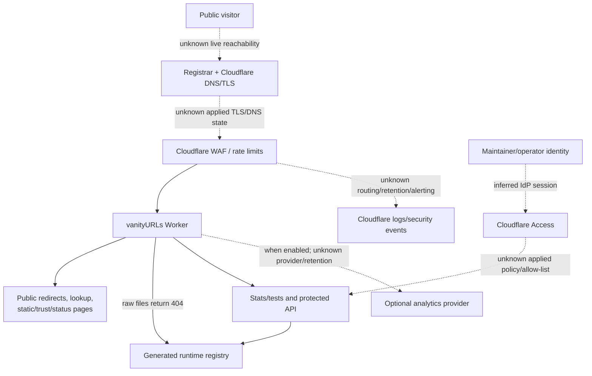

# Edge Exposure View

## Purpose And Evidence Boundary

- Reader question: Which routes and data cross public, protected, and third-party boundaries?
- Evidence cutoff: July 22, 2026.
- Confirmed notation: Solid edges are implemented or declared in cutoff-pinned source/configuration.
- Inferred notation: Dashed `inferred` edges are documented external integrations not observed live.
- Unknown notation: Dotted `unknown` edges require applied-control, ownership, reachability, or provider proof.
- Evidence links: [Architecture trust ADR](../../architecture/adr/ADR-004-layered-edge-and-operational-access-controls.md), [recovery packet](../../../evidence/packets/recovery-and-operations.md), [secret/identity surface](../secret-and-identity-surface.md).

## Evidence Dimensions Used

Implementation and intended edge configuration are present. DNS/TLS reachability, applied WAF/Access, secret custody, alert delivery, privacy acceptance, and live effectiveness are unknown.

## Diagram

## Known Gaps And Follow-Up

The diagram shows source/configuration intent, not a penetration test or live reachability result. OI-002/OI-006 close ownership, applied controls, DNS/TLS, secrets, alerting, and recovery; OI-004 validates representative public/protected behavior without exposing credentials.
